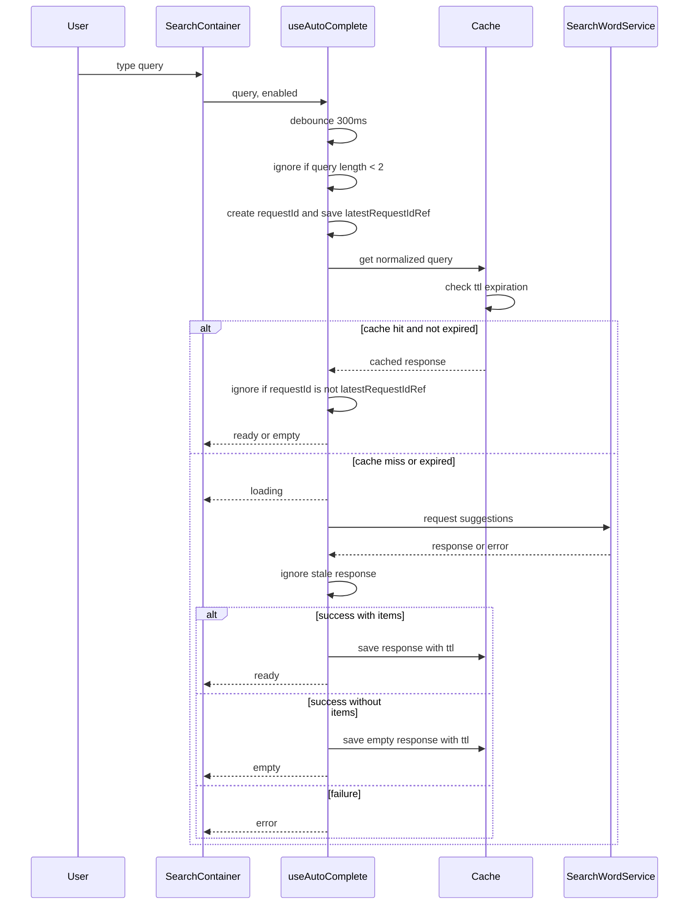

# RADIO 설계 방식을 활용하여 검색어 자동 추천 컴포넌트를 설계해보자

## 개요

하나의 컴포넌트라도 역할에 따라서 더 상세한 설계가 필요할 때가 있다. 다만, 설계를 어떠한 기준과 절차로 진행해야 좋을지는 개발자마다 의견이 다른듯 함.
프론트엔드 내 설계는 서버와 차이가 있는데, Data Model 뿐 아니라 실제 이 Data 가 사용자가 마주하는 View 와 어떻게 상호작용을 해야할지, 그리고 View 에 표현된 State 의 유기적인 변화를 감안하여 추가적인 설계가 필요하다.

특히나 실제 사용자가 해당 컴포넌트를 사용할 때, 겪을 수 있는 많은 경우의 수와 애로사항을 모두 고려해야하기에 단순히 '특정 기능을 위한' 설계를 하게 되면 낭패를 당할 수 있다. 

이에 실제 요구사항과 이를 기반한 구조, 그리고 실제 컴포넌트를 이루는 데이터들과 구조체, 성능을 모두 고려해서 설계하는 **RADIO** 방식을 검색 컴포넌트를 만들면서 하나씩 살펴보도록 하자.

### R : Requirement

특정 페이지나 컴포넌트, 비즈니스 로직에 대한 실제 요구사항이다.
가장 중요한 부분인 점은 사실 이 요구사항만 잘 파악하고, 분배해도 그대로 설계로 이어질 수 있다는 점이며, AI 시대 내 명세서 역할을 하기에 요구사항을 제대로 파악하는것이 중요하다.

요구사항을 파악하고 정리하는 과정에서는 특정 개발론이 들어갈 필요가 없다고 생각한다. 
도메인 주도 설계나 데이터베이스의 설계, 어떠한 프레임워크 내 상태관리 라이브러리를 사용할건지 등등 개발적인 고려사항이 아니라 실제 서비스를 제공받는 사용자 입장과 제공하는 회사 입장에서 상세하게 작성하는것이 추후 설계하는데 유리할 것이다.

예제로 삼은 **추천어 자동완성 Input component** 의 요구사항을 생각해보면 다음과 같을 수 있겠다. 
(이건 예시이니 실제 설계를 하실 때는 더 상황에 맞게 설정하는게 좋겠다)

- 사용자가 텍스트를 입력하면 Input 아래 위치에 추천 검색어 목록이 노출된다.
- 사용자는 해당 검색어를 마우스로 선택 및 클릭하면 해당 검색어로 검색이 된다. (다만 현재 구현과정에서는 검색어 state 를 선택한 state 로 변경하는것으로만 마무리 한다)
- 검색어 추천은 2글자 이상이 되면 나타나도록 한다
- 검색어 추천목록은 스크롤이 가능하다
- 추천검색어에서 검색어가 겹치는 부분은 굵게 표시한다.
- 검색어가 focus 되는 상황은 마우스 호버, 키보드 focus 시 이루어지며, focus 시 배경색이 다른 색으로 변경된다
- 키보드를 이용한 검색어 선택은 화살표 위아래를 이용하여 이동하고, 엔터를 입력하면 선택된다.
- 추천검색어를 가져오는 과정에서의 Loading 화면이 필요
- 추천검색어를 가져오지 못하거나 검색 결과가 없을 때의 화면도 필요

요구 조건을 살펴보면, 비즈니스 규칙도 존재하고, UI 적인 규칙도 존재한다. 또한 기능적인 요소가 아니라 비기능적 요소 역시 존재할 수 있다.

- 추천어는 빠르게 보여야한다. 
- API 호출을 과도하게 보내면 안됨.
- 느린 네트워크에서도 잘 동작해야 함.
- 모바일과 데스크톱 모두 지원 
- 접근성 
- api 실패시에도 검색창 자체는 계속 사용할 수 있어야함.

'빠르게', '호출을 과도하게', '느린 네트워크' 등 추상적인 요구 조건이 있을 때는(비기능적으로), 실제 설계에 들어갈 때 수치로 구체화 해주는것이 좋다.

### A: Architecture

요구 사항을 기반으로 설계를 진행할 수 있다. 또한 설계를 진행하다보면 요구사항에서 미쳐 고려하지 못한 상황도 발생하기에, RA 단계에서 많은 검토가 필요하다. 

프론트엔드에서 구조를 설정할 때는, 본격적으로 개발적인 요소를 고려하면서 layer 구조, 폴더 구조, 실행 흐름, 이에 따라 필요할 수 있는 오픈소스가 있다면 명시해줘도 좋다.

우선은 개발함에 있어 조금 더 고려되어야 할 사항을 먼저 고려해본다.

- 검색어의 경우 **비동기적 서버 요청**이다
    - 이에 따라 과도한 호출을 방지하기 위한 debounce 설계가 필요
    - race condition 을 고려하여 가장 최종적으로 완성한 결과물을 띄어줘야 함
    - 같은 결과를 계속 호출하는것은 낭비이니 내부 cache 처리르 통해 cache 값이 존재한다면 cache 값을 바로 보여준다. cache 는 서버에서 처리하는것이 적합하지만, 현재로서는 해당 cache 가 client 내에서 처리되어야 한다는 조건을 가지도록 한다.
  
> 비동기적 요청이라는 부분에서 발생할 수 있는 사용 에로사항을 최대한 고려해야 한다

- 검색어 요청은 UI 입력 흐름과 분리한다.
    - Input 은 query 를 관리한다.
    - debounce 이후의 요청 실행은 hook 또는 service 에 위임한다.
    - 응답 DTO 는 UI 에서 바로 쓰지 않고 RecommendWord 로 변환한다.
    - Input 은 controlled component 이다. 

> 최대한 함수는 단일 책임을 가지도록 해야하고, 일정 boundary 내에서 책임을 지어야 하는 것들을 결정하는것이 좋다. UI 적 요소는 UI Layer 내에서 책임을 가지는것이 좋다. 즉, service 내 함수가 UI 의 state 까지 관여하지 않도록 해야 추후 유지보수도 좋으며, AI 를 통한 TDD 설계에서도 더 정확한 결과를 가져올 수 있다.
또한 마지막처럼 요구사항에 따라 controlled component 으로 해야할지 결정할 수 있다. 여기서는 검색어의 변화에 따라 즉각적으로 api 요청을 보내야 하기에 비제어로 설정하지 않았다.

- dropdown 상태는 요청 상태와 결과 상태를 함께 표현한다.
    - loading: 요청 진행 중
    - ready: 추천 결과 존재
    - empty: 요청은 성공했지만 추천 결과 없음
    - error: 요청 실패
- focus 상태는 mouse hover 와 keyboard navigation 이 같은 값을 바라보도록 한다.
    - focusedIndex 를 기준으로 현재 focus 된 추천어를 계산한다.
    - mouse enter 시 focusedIndex 를 갱신한다.
    - arrow up/down 시 focusedIndex 를 갱신한다.
- 선택 이벤트는 검색 이벤트와 다르게 처리한다.
    - 추천어 선택 시 query 를 선택된 value 로 변경한다.
    - dropdown 을 닫는다.
    - 선택으로 인한 query 변경은 debounce 요청을 발생시키지 않는다.

> 설계 단계에서 실제 사용될 state 들의 명시적 분리를 명확하게 해주면 좋다.

- cache 는 추상 클래스 뒤에 숨긴다.
    - 현재 구현은 memory cache 로 시작할 수 있다.
    - 이후 Web Worker 기반 cache 로 바꿔도 UI 와 service 호출부는 유지한다.
    - cache key 는 trim/lowercase 처리한 query 를 사용한다.
- mock server 는 실제 서버 경계를 흉내낸다.
    - Promise 기반으로 응답한다.
    - setTimeout 으로 latency 를 만든다.
    - 특정 query 에서는 실패를 발생시켜 error 상태를 확인한다.
    - 결과가 없는 query 는 empty 상태를 확인하는 데 사용한다.

> 상황에 따라서는 서버와 바로 연동을 할 수 없기에 이에 클라이언트 단에서 테스트 해볼 수 있는 상황도 결정해두면 좋다.

앞서 요구사항에 더해 조금 더 비기능적인 요소를 개발관점에서 고려해보았고, 이제 이를 기반으로 책임 분리와 흐름을 작성해본다.



mermaid 로 깔끔하게 흐름이 정리되면 더욱 좋다. 다만, 중요한것은 각 함수별 책임을 어떻게 나눌것인지 개발자가 명확하게 이해하고 있어야 하고, 정해진 문서를 기반으로 ai 에게 도표로 작성해달라고 요구해주면 흐름을 더 쉽게 정리할 수 있을 것이다.

위 흐름을 살펴보면,

- 사용자는 검색창에 검색어 입력
- debounce 처리를 통해 요청 딜레이
- 조건(2글자 이상) 통과 시, race condition 을 위한 requestId 를 최신화
- 서버에 요청하기 위한 query 를 정규화 하여 통일
- 해당 query 가 cache hit 인지 아닌지 파악 (key 에 해당하는 value 가 있는지, ttl 내 value 인지)
- hit 라면 그대로 cache 사용, 아니라면 server 요청
- 전달받은 응답을 cache 저장 및 show result

### D: Data Model

사실 여기부터는 개인적으로는 처음부터 확정시키고 개발을 들어가는게 적합한지는 의문이 있지만, 분명 확실하게 잡고 가면 그만큼 추후 Interface 를 설정함에 있어서 더 명확해지는 장점이 있으니, 충분히 고려를 하는게 좋다.

data model 을 설정할 때, server state 와 client state 를 분리하여 최신성을 어디서 갱신받아야 하는지 명확하게 하는것이 좋다.

현재 server state 는 명확하게도 추천 검색어 목록이다.

- SearchWordDto : 단일 검색어
- AutoComplateSearchResponseDto: 전체 검색어들

client state 는 UI 와 밀접한 관계를 가지는데, 화면 내 **현재상태** 를 나타내는 state 들과, 표현될 데이터들인 props 를 미리 구상해놓으면 좋다

- inputValue / selectedSuggestionValue : 검색어 문자열과 선택된 검색문자열
- AutoCompleteDropDownState : 추천 조회 및 드랍다운 표시 상태  
- isDropDownOpen : 드랍다운 열림 상태
- focusedIndex : 마우스 hover 나 키보드 조절 시 focus 된 검색어의 위치를 나타냄
- isPending : 검색어 요청 pending

생성할 input 및 dropdown, container 내 props 

- AutoCompleteInputProps
- AutoCompleteDropdownProps

### I: Interface

지금까지 설계를 했다면, 이제 조금 더 구체적인 구조체 설정을 할 수 있다. 

이 부분은 최근에는 Ai 에게 위임하는 경우도 있는데, 개인적으로는 그래도 직접 구조를 작성하는것이 추후 유지보수를 하거나 새로운 기능을 추가할 때 이해도 측면에서 차이가 발생한다고 경험상 느낀다. 

구조체의 경우 DataModel 내에서 설정한 부분을 더 구체화하고, Architecture 내에서 작성한 흐름도를 기반으로 작성할 수 있고, 추가할 부분이 있다면 추가해주도록 하자. 

```typescript
// 모든 구조체를 작성하진 않겠습니다.

export interface SearchWordDto {
    id: string;
    value: string;
}

export interface AutoComplateSearchResponseDto {
    total: number;
    items: SearchWordDto[];
}

// services
type UseAutoCompleteParams = {
    query: string;
    enabled?: boolean;
};

function useAutoComplete(params: UseAutoCompleteParams): {
    status: AutoCompleteState;
    isLoading: boolean;
    suggestionCount: number;
    suggestions: SearchWordDto[];
};

type UseAutoCompleteInteractionParams = {
    query: string;
    status: AutoCompleteState;
    suggestions: SearchWordDto[];
    onSelect: (value: string) => void;
};

function useAutoCompleteInteraction(params: UseAutoCompleteInteractionParams): {
    isOpen: boolean;
    open: () => void;
    close: () => void;
    focusedIndex: number;
    setFocusedIndex: Dispatch<SetStateAction<number>>;
    handleMouseEnter: (index: number) => void;
    handleKeyDown: (event: KeyboardEvent<HTMLInputElement>) => void;
    selectWord: (word: SearchWordDto) => void;
};

// component props

type AutoCompleteInputProps = {
    value: string;
    onChange: (value: string) => void;
    onFocus: () => void;
    onBlur: (event: FocusEvent<HTMLInputElement>) => void;
    onKeyDown: (event: KeyboardEvent<HTMLInputElement>) => void;
};

interface AutoCompleteDropdownProps {
    query: string;
    status: AutoCompleteState;
    suggestions: SearchWordDto[];
    focusedIndex: number;
    onMouseEnter: (index: number) => void;
    onSelect: (word: SearchWordDto) => void;
}

```
구조체를 초기에 확정을 짓고 개발에 들어간다면 장점이 많다

- 실제 구현을 하는 과정에서 정해진 구조를 준수하여 작업하기에 실수를 줄일 수 있음
- 테스트 주도 개발 시 구조기반으로 mock 함수 생성이 용이해진다
- AI 가 실제 구조체를 바탕으로 구현까지 이어지도록 설정하는것이 더 용이해진다.

### O: Optimization

성능 최적화에 대해서는 여러가지 방식이 존재할텐데, 서비스의 성질과 규모에 따라서 그 종류가 결정될 수 있다.

가령 검색 엔진의 경우 어떠한 성능을 주목해야할까

우선은 사용자가 검색어를 2글자 이상 입력할 때, 제대로 dropdown 이 나오면서 첫 추천 결과가 화면에 표시되기 까지의 시간이 있을 수 있다.
예상하는 delay 는 debounce 의 300ms + api latency 시간이 걸릴 것이고, 너무 느리다면 debounce 보다는 api latency 를 체크해봐야한다.
또한 cache hit 의 경우 delay 가 줄어드는지도 확인할 수 있겠다.

> 측정은 검색어 입력 시 `performance.mark` 를 통해 start 를 설정, 렌더링 이후 end 를 설정하여 `performance.measure` 를 통해 비교한다

측정결과가 느려 api latency 에 대해서 측정할때는 보통 chrome 내 network tap 내에서 직접 확인해도 좋고, 내부 함수에서 `performance.now` 로 해도 된다. 

또한 추후 log 분석을 할 때 지표로서 사용될 만한 것들은

- api error rate
- cache hit rate

정도가 있지 않을까 싶다. 

위 고려사항은 모두 검색 엔진의 한하여 성능의 최적화를 생각한 것이고, React 를 사용하는 경우 해당 컴포넌트가 사용되는 함수의 렌더링 최적화가 제대로 되어있는지 체크해볼 필요가 있다. (다만 개인적으로 성능에 크게 영향을 주지 않는다면 React.memo 와 useMemo를 잘 활용하지는 않는 편)

> 참고로 첫 프로젝트 설정 시, 외부 analyics SDK 를 사용하는 경우 측정할 수 있는 지표가 증가할것이다. 이는 개발팀 내에서의 상의로 설정하면 된다.

### 설계의 정확성은 명세의 정확성. 그리고 이를 활용하는 AI

최근 AI 주도 개발이 대세가 되고 있는 시점에서, 정확한 명세서는 무의미한 token 사용을 줄여줄 인간의 효율성이다. 
이전 테스트 코드가 곧 사용 함수 및 서비스의 명세서라는 부분에 있어 TDD(테스트 주도 개발)의 중요성을 설파하신 개발자분들이 많이 계셨지만, 
테스트 코드를 위한 코드를 작성하다보면 (즉, 테스트 코드를 통과하기 위한) 구조가 흔들리는 경우가 있었고, 무엇보다 테스트 코드를 항상 작성해야하기에
스타트업 내에서 업무를 하다보면 그 시간을 쓰지 못할 때도 있었던 것 같다. 그렇기에 테스트 주도 개발을 제대로 활용하지 못했었다.

그러나 현재에서는 AI 로 인해 TDD 를 구현하기 훨씬 용이한 환경이 되었고, 
그렇다면 이를 통한 구조의 흔들림을 더욱 개발자가 엄격하게 제어를 할 필요가 있어졌다고 생각한다. 
그 결과가 하나의 프로젝트에 있어서 엄격한 설계를 진행하고, 이러한 설계가 명세가 되어 테스트 코드 및 실제 구현 코드로 ai 를 통한 생성이 token 낭비를 줄이면서 추후 유지보수에 있어 코드 이해가 더 쉬워지는 결과라 생각이 든다.

RADIO 설계 방식은 실제 활용해보니 시간이 더 소요되는 단점이 있지만, 요구사항을 개발적으로 더 명확하게 처리하여 에러 발생을 줄이고, 구조를 더 명확하게 잡는데 좋은것 같았다. 
모든 설계를 위 방식대로는 하지 않겠지만, 적어도 RADIO 중 **RA** 만큼은 확실하게, 시간을 충분히 들여서 설계를 진행해야 겠다.

실제 자동완성 검색어의 코드 구현 과정은 다음 포스트에서 다뤄보겠다.


