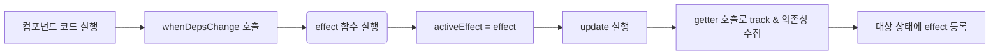
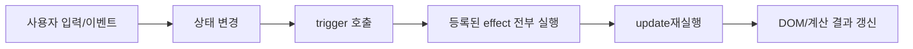

## 언제나 시작은 문제사항의 발생

tanstack query 를 사용하면서 각 컴포넌트에 재원생의 정보, 비재원생의 정보, 퇴원생의 정보에 대해서 각각의 InfiniteQueries 훅을 통해 데이터를 가져오고 있었습니다.
문제는 여기서부터인데, 특정 검색 페이지에서는 조건부 렌더를 통해서 상태가 재원생이라면 재원생 검색 리스트를 렌더링 합니다.

```html
<script setup lang="ts">

// query 에 대한 error 를 capture 하고자 함
const { capture } = useQueryErrorCapture();

// 재원생 학생 리스트 호출
const { academyStudents, isPending, nextFetching, error } = useInfiniteQuries(computed(() => academyId));

watchEffect(() => {
	if(error.value){
		// 적절한 alert 를 띄어줌
		capture(error.value)
	}
})

</script>

```

많은 부분을 생략하였지만, 기본적인 흐름은 위 코드와 같습니다. 여기서 특징점은 tanstack-query/vue 내에서 호출되는 error 의 경우 composition api 인 ref 로 감싸진 proxy 객체입니다.
ref 이기 때문에 proxy 객체 내 getter, setter 를 기반으로 effect 를 발현시키는 로직이었고, 기존 학급관리 내 모달에서 에러 발생 시 적절하게 반응했었던 것이 기억됩니다.

문제 사항은 401 인증 에러가 발생하면서 발생합니다.

보통 401 에러가 발생하게 되면, 강제 로그아웃이 필요하기 때문에 10초의 기간 내 자동으로 로그아웃 해주는 로직이 실행되고, 이를 알려주는 alert 가 실행이 됩니다.
의도대로라면 alert 가 실행이 되면, 로그아웃 하기 버튼을 클릭하고 /auth 로 routing 이 되면 끝인데, 이상하게 한번 더 alert 가 실행이 됩니다.
(아니 캐시를 초기화 하지 않았을때는 무려 4번이나 alert 가 실행이 되었습니다.)

현재는 watch 로의 변경으로 해결하였지만, 그 이유가 궁금해졌습니다.
현재까지 처리한 방법은 다음과 같습니다.

- (첫번째 시도) 호출 query 들의 cache 된 state 를 삭제해줍니다. -> 로그아웃 이후 한번의 alert 가 더 띄어지고, 그 다음 로그인 했을 때는 다시 동작
- (두번째 시도) watchEffect 를 watch 로 변경하고 추적 객체를 error 로 한정짓기 -> 현재 발생한 문제 해결

## vue 의 반응성

vue의 반응성은 결국 기본적은 구성 요소 갱신에 대한 자동화를 위한 설계를 따르고 있습니다.

- view = f(state)

결국 화면은 state 의 변화로서 컨트롤 되게 되는데, 이를 위해 vue 는 proxy 객체를 활용합니다.

예를 들어 변수 a와 b 를 합치는 update 함수가 있다고 가정합니다.

```tsx

let a = 2;
let b = 3;
let c;

function update() {
	c = a + b
}

update();

console.log(c); // 5

a = 3;

console.log(c) // 5

```

우리가 기대하고 구현하고자 하는 것은 a 와 b 에 의존적인 update 가 자동적으로 실행되기를 원하지만, 자바스크립트 내에서는 그러한 기능은 없습니다.
대신 proxy 객체를 활용하여 getter, setter 를 가로채어 원하는 동작을 추가할 수 있는데, 이러한 방식을 통해 vue 는 반응성을 구현했습니다.

참고로 vue2 내에서는 브라우저의 호환성 문제로 오직 getter, setter 만을 이용한 반응성 구현이었다면, vue3 는 proxy 객체를 활용하게 되었습니다.

vue 는 함수 단위의 실행으로서 view 를 컨트롤 한다기보단, 특정 변수를 track 할 수 있도록 구독(subscribe) 해 놓은 다음, 해당 변수의 변화가 발생할 시, 같이 구독해놓은 effect 들을 실행시킴으로서 상태의 변화를 특정 effect 로 확장시킵니다.
이러한 확장성은 특히나 DOM 의 변화를 주는 방향으로 진행될 수 있고 이렇게 되면 결국 앞서 살펴본 공식처럼 됩니다.

```tsx
function reactive(obj) {
  return new Proxy(obj, { // proxy 객체를 생성하여 get, set 내 동작을 심어줍니다.
    get(target, key) { // target 은 effects 이고, key 는 해당 변수라 생각하면 됩니다.
      track(target, key) // target 과 key 를 track 합니다.
      return target[key]
    },
    set(target, key, value) {
      target[key] = value
      trigger(target, key) // 해당 key 를 구독하는 모든 effect 들을 실행시킵니다.
    }
  })
}

function ref(value) {
  const refObject = {
    get value() { // getter 가 사용됩니다.
      track(refObject, 'value') // value 라는 속성(key) 에 refObject 를 전달합니다.
      return value
    },
    set value(newValue) { // setter 가 사용됩니다.
      value = newValue
      trigger(refObject, 'value') // 해당 ref 를 구독하는 Effects 를 실행시킵니다.
    }
  }
  return refObject
}

```

여기서 track 은 내부에서 현재 실행중인 이펙트가 있는지 확인하고, 이펙트가 있다면 추가도 해줍니다.
반대로 trigger 의 경우 해당 속성의 구독자 이벤트를 찾아 모두 호출합니다.

> [!warning]
주의할 점은 getter, setter 로 구성된 객체이기에 구조 분해 할당을 할 경우, root 변수에 한하여 반응형 track 이 깨져버리게 됩니다. 그렇기 때문에 왠만하면 구조 분해 할당은 하지 않는것이 좋습니다.
> 

한번 요약해서 살펴보면

```tsx
// 예시 이니 전역에 activeEffect 가 있다고 가정합니다
let activeEffect;

const track = (target, key) => {
	if(activeEffect){
		const effects = getSubscriberForProperty(target, key);
		effects.add(activeEffect); // 해당 속성에 bind 되어있는 effects 를 호출하여 activeEffect 가 있다면 추가합니다.
	}
}

const trigger = (target, key) => {
	const effects = getSubscriberForProperty(target, key);
	effects.forEach((effect) => effect()); // 속성에 bind 되어있는 effects 를 모두 실행 시킵니다.

}

// 특정 effect 를 등록하는 함수가 있다고 한다면
const whenDepsChange = (update) => {
	// 자기 자신을 activeEffect 에 선언합니다 (자바스크립트 내 함수는 일급 객체라 전역 변수에 자기 자신의 참조를 저장할 수 있습니다.)
 	const effect = () => {
	 	activeEffect = effect
	 	update() // 해당 함수가 실행되면 지역 내 track 이 발생할 변수가 있을 것이고, 해당 track 은 전역변수 activeEffect 를 수집할 수 있습니다.
	 	activeEffect = null
 	}
 	effect()
}

```

실행과정을 요약하면 다음과 같습니다.

- 첫 페이지(컴포넌트) 와 같은 script 가 실행됨
- whenDepsChange 한번 호출
- effect 함수 실행으로 activeEffect 내 자기 자신이 등록
- update 실행
- update 내부 내 상태값들에 대한 effect 저장 (추후 해당 상태들이 변화될 때마다 실행될 effect 이자 현 예제에서는 update)
- 이후 만일 update 내부의 상태의 변화가 발생하게 되면 trigger 발동
- trigger 는 해당 상태 내 등록된 effect 전부를 실행시킴 (현 예제에서는 effect 가 실행 - update 의 실행)
- update 로 인한 결과값 수정

참고로 effects 는 전역 데이터 구조로서 `WeakMap<target, Map<key, Set<effect>>>` 구조를 띄고 있습니다.





이러한 특징은 의외로 사이드 이펙트를 발현시키는 조건이 반응형 상태들이 whenDepsChange 와 같은 구독성 함수 내부에 존재해야함을 알 수 있는데,
실제 vue 3 내 composition api 로는 대표적으로 watchEffect, computed 등이 있겠습니다.

사실 두 상태(숫자)의 합을 구하는 update 의 경우 computed 와 같은 계산 속성을 활용하는것이 더 좋지만, watchEffect 와 같은 반응형 이펙트는 상태 변화에 따른 DOM 업데이트에 적합하게 활용될 수 있습니다.
이러한 방식은 실제로 vue 가 상태값과 DOM 을 연결하는 방식과 매우 유사하며, 자세한 부분은 렌더링 메커니즘에서 찾아볼 수 있겠습니다.

## 결국 반응형 이펙트의 역할에 따라서 추적하는 상태가 달라진다

watchEffect 의 경우 내부 모든 반응형 객체에 대한 추적을 진행합니다. 즉, 무엇 하나라도 변경(set) 이 된다면 이를 바로 trigger 할 것입니다.

첫 컴포넌트의 실행에서 watchEffect 는 현 상태에 대해서 모두 구독합니다. 그리고 한번은 무조건 실행합니다. (이는 앞선 whenDepsChange 함수를 떠올리면 됩니다.)

> [!info] 즉각 반응의 이유
watch 의 lazy 동작과는 달리, watchEffect는 내부 모든 반응형 값을 감지해야 합니다. 그렇기에 특정 감시 값에 대한 변화만을 감지하는 방법으로는 감지하지 못하는 경우가 발생할 수 있습니다
이에 watchEffect 는 첫 mount 시 한번 실행 되어 내부 모든 반응형 값을 추적합니다. 이후 추적된 값들 중 일부가 변동이 생긴다면 이에 따른 trigger 를 실행시킵니다. 해당 trigger 내에는 해당 watchEffect 내 effect 가 포함입니다.
> 

이러한 특징을 생각해 볼 때 앞선 error alert 의 중복 호출에 대해서 유추해볼 수 있습니다.

- error.value 라는 반응형 값 외에 어떤 무언가의 반응형 값의 변동이 존재하였고, 이를 watchEffect 가 미리 감시해놓고 있기에 반응하게 됨

```tsx

watchEffect(() => {
	if(error.value){
		// 적절한 alert 를 띄어줌
		capture(error.value)
	}
})

```

해당 로직을 다시 살펴본다면, watchEffect 는 error.value 뿐 아니라 capture 라는 추상화 된 함수 내부 반응형 값을 감시하고 있음을 알 수 있습니다.
이렇기에 capture 로직을 살펴보는 과정에서 수 많은 ref 가 있음을 확인 할 수 있었습니다.

문제는 너무 많아서 디버깅을 하기가 쉽지가 않은데, 이러한 경우 디버깅을 도와주는 기능이 vue3에서는 제공해줍니다.

```tsx
<script setup>
import { onRenderTracked, onRenderTriggered } from 'vue'

onRenderTracked((event) => {
  debugger
})

onRenderTriggered((event) => {
  debugger
})

// 이펙트 내부 추적
watch(source, callback, {
  onTrack(e) {
    debugger
  },
  onTrigger(e) {
    debugger
  }
})

watchEffect(callback, {
  onTrack(e) {
    debugger
  },
  onTrigger(e) {
    debugger
  }
})
</script>

```

참고로 debugger 는 개발 모드에서만 작동하기에, npm run dev 를 통해서 체크해볼 수 있겠습니다.
watchEffect 를 그대로 추적하기 위해 onTrack 과 onTrigger 내 debugger 를 설정하여 실행마다 멈출 수 있도록 처리합니다. (IDE 내에서 debugger 를 설정해도 될 것입니다.)
이후 매 과정마다 debugger 를 실행시켜서 어떠한 반응형 값을 추적하는지, 어떠한 값의 변동으로 인해 trigger 가 발동하는지 확인할 수 있습니다.

(현재 문제점에 있어서는 onTrigger 내 debugger 를 설정하는것 만으로도 충분할 것입니다.)

```tsx
watchEffect(() => {
	if(error.value) capture(error.value)
}, {
	onTrigger: (event) => {
		// 검증하고자 하는 로직 실행
		debugger;
	}
})

```

!스크린샷 2025-10-15 오전 8.18.17.png

디버거를 추가하면 다음과 같이 각 추적마다 paused 가 되어 어떤 값을 추적하는 지 체크하기가 수월해집니다.
이런식으로 디버깅을 하다보면 현재 capture 내에 특이한 점이 발견되었는데, capture 내부 popup manager 내에서 관리하는 popupItems 라는 배열이었고, 해당 배열은 ref 로 감싸져 반응성을 유지하고 있었습니다.
watchEffect 는 이를 감지하였고, 해당 배열의 변화에 따라 다시 내부 effect 를 실행하는 방향으로 나아갔습니다.

!스크린샷 2025-10-15 오전 8.18.31.png

watchEffect 는 error.value 의 변화를 감지하여, 해당 문제에 대한 alert popup 을 띄어줍니다. 위 콘솔기록은 newValue 내 새로운 popup object 가 popupItems 내 추가됨을 알 수 있습니다.

이제 로그아웃 팝업이 열리고, 해당 팝업 내 '로그아웃' 버튼을 클릭해줍니다.

!스크린샷 2025-10-15 오전 8.18.46.png

팝업이 닫히면서 clearPopup 이 실행되고 popupItems 의 배열이 빈배열로 변경됩니다 (!!! 변화가 발생)
watchEffect 는 해당 변화 역시 놓치지 않습니다. 내부 상태값의 변화는 상태값이 구독중인 effect 를 실행시키도록 합니다. 당연하게도 watchEffect 내 capture(error.value) 를 실행시킵니다.
현재 error.value 는 여전히 값이 존재합니다. 왜냐하면 실제로 401 에러가 발생하여 error 가 존재하기 때문입니다. (해당 값은 아직 초기화 되지 않았습니다.)

따라서 if(error.value) 분기를 타고 다시한번 capture(error.value) 를 실행합니다. 이는 로그인 페이지로 리다이렉트 되기 전 발동합니다.

!스크린샷 2025-10-15 오전 8.18.57.png

해당 에러 알림 팝업이 다시 열리면서 로그인 페이지로 리다이렉트 됩니다.

이러한 특징은 초반에 로그인 이후에도 에러 알림이 뜨는것을 설명해줍니다. watchEffect 는 task queue 내에서 계속해서 감지된 변화에 대한 effect 를 실행시킵니다.
여기에 더해 error.value 가 아직 존재한다면 (즉, query 가 다시 실행되어 error.value 가 null 이 되기 전) 계속 팝업이 발생하게 됩니다.
다만 query 의 재실행 및 갱신으로 error 가 사라진다면 if 분기를 타지 않기에 더이상 capture 함수가 실행되지 않기에 이 이상의 문제는 발생하지 않습니다.

앞에서 설정해둔 query.removeCache를 처리하였을 때, 로그인 이후에는 팝업이 나타나지 않았다는 부분이 설명이 됩니다.
query 의 cache 를 모두 삭제하였기에, error.value 역시 null 이기에 분기를 타지 않아 에러 팝업이 나타나지 않았던 것이죠.

!스크린샷 2025-10-15 오전 8.19.15.png

## watch 로 변경하게 되었을 땐

사실 직감적으로 watch 를 통해 감지한다면 해당 이슈는 발생하지 않을 것이라는 것을 알았지만, watchEffect 와의 차이점이 궁금했었습니다.

공식문서 내 watch 의 설명을 보게 되면 간단하게 그 이유를 알게 되는데,  요약하자면 다음과 같습니다.

> [!info] watch
watch 는 반응형 데이터의 변화를 감지해 side effect 를 실행할 때 사용합니다
기본적으로 lazy 하게 동작하며, 감시하는 값이 변경될 때만 콜백이 실행됩니다
명시적으로 감시하는 소스만을 추적합니다. 즉 콜백 내부에서 접근한 값은 추적하지 않습니다.
> 

여기서 현재 이슈에 대한 핵심 사항은 마지막 줄입니다.
명시적으로 감시하는 소스인 error.value 만 추적하기 때문에, error.value 가 변하게 된 시점 (401 에러가 발생) 에만 한번 capture(error.value) 가 실행되게 됩니다.

## watchEffect 를 그대로 사용하는 방향은 어떤것들이 있을까

watch의 경우 사이드 이펙트를 명시적으로 사용할 때 좋지만, 의존성 값들이 많아지면 질 수록 내부에서도 해당 값들을 사용하는 effect 라면 watchEffect 가 훨씬 간결하게 코드를 작성할 수 있습니다.

현재 발생한 이슈를 watch 를 사용하지 않고 watchEffect 내에서 처리하는 방법들은 여러가지가 있을 수 있겠는데, 다음과 같겠습니다.

### 분기 자체를 타지 못하도록 처리

전역 변수의 설정으로 분기 자체를 넘어서도록 처리하는 방법입니다.

```tsx

let isFirstError = true;

watchEffect(() => {
	if(error.value && isFirstError) {
		isFirstError = false;
		capture(error.value);
	} else {
		isFirstError = true;
	}
})

```

컴포넌트 내부의 변수이긴 하지만 전역변수는 그렇게까지 좋아보이진 않습니다. 그래도 가장 간단하게 발생한 이슈를 처리할 수는 있어 보입니다.

### side Effect 를 effect 추적 바깥으로 밀어내기

watchEffect 내 추적으로 인해 내부 effect 가 실행될 때 popupItems 가 잡히는것이 문제인 것인데, 그렇다면 error 가 발생했을 시점 내 effect 실행이 종료된 뒤 popupItems 가 변화한다면 현 이슈를 해결할 수 있습니다.

이를 위해서 task queue 를 구별하는 방식을 사용할 수 있습니다. (microtask queue decoupling)

```tsx
const runOutsideTracking = (fn: () => void) => queueMicrotask(fn);

watchEffect(() => {
	if(error.value){
		runOutsideTracking(() => capture(error.value)) // 해당 작업이 마이크로태스크 큐로 이전된다.
	}
})

// 이러한 방식과도 동일하다
watchEffect(() => {
	if(error.value){
		setTimeout(() => {
			capture(error.value)
		}, 0)
	}
})

```

브라우저 환경에서는 단일 스레드 자바스크립트의 작업에 비동기 작업을 설정하기 위해 (실제로는 동기적인 흐름이지만) task queue 를 통해서 특정 작업들을 분리합니다.
이 중, promise 작업이나 setTimeout 과 같은 작업들은 마이크로태스크 큐로 이전되는데 이를 이용한 방식입니다.

현재 이슈 해결에는 굳이 사용하지 않을 수 있지만, 인지하고 있다면 언제든 유용하게 활용될 것으로 예상됩니다.

### vue-query 내 전역 onError

현재 이슈는 vue-query 내 error 객체와도 연결되어 있고, query 는 전역 queryClient 내에서 onError 로 에러 발생시 popupManager 를 호출하여 popup을 관리할 수는 있습니다.
한번에 관리한다는 것은 분명 편리성을 줄 수 있으나, 현 회사 내 제품은 특정 상황 에러에 따른 여러 처리가 필요한 경우가 있어서 발생하는 에러에 한해서 해당 view 에서 처리하는것을 규칙으로 삼고 있습니다.

## 결론은 watch 를 사용

에러의 발생에 따라 팝업을 띄어 그 이후의 동작을 이어가는 작업은 `부수 효과(side effect)` 에 적합하다 생각합니다.
해당 effect 내 작업을 microtaskqueue 로 전달하는 방식을 사용하기에는, 현 이슈에서는 굳이? 라는 생각이 들었습니다.

- watch 를 통한 명시적인 의도를 개발자 및 다른 사용자에게 전달
- 사이드 이펙트에 맞는 사용방식

watchEffect 는 내부 모든 반응형 값에 대한 추적이기에, 자칫 내부 effect 의 발동 의도를 다른 동료가 햇갈릴 수 있다고 판단이 들었습니다.
그리고 마이크로 태스크 큐로의 작업 분배는 `해당 이슈를 해결하기 위한 또 하나의 추가 조치` 이기에 명확하게 부수 효과를 줄 수 있는 watch 를 두고 굳이 이렇게 할 필요가 없습니다.
코드는 언제나 직관적인것이 좋다는것이 제 판단입니다.

그럼에도 이번 과정을 통해 렌더링 과정에서의 반응형 추적과 실제 debugger 를 통해서 흐름을 파악하는 방식을 연구해 볼 수 있어서 좋은 경험이었습니다.
아직 vue 내 렌더링 과정을 다 파악하지 못했다는 생각이 들면서 react 를 활용한 프로젝트 작업도 좋지만, 현재 회사에서 사용중인 vue 에 대해서 더 깊게 판단할 수 있는것도 중요함을 알게 되었습니다.